# Dimba Itambe Football League Web Application

A comprehensive football league platform with ticketing, team information and other football league related content.

## Features

**Ticket Purchasing System**
  - M-Pesa payment integration
  - QR code generation for tickets
  - Email notifications with ticket details
  - Payment callback handling

**Team & Player Management**
  - Player statistics display
  - Team rosters and information
  - League standings

**Match Information**
  - Fixtures schedule
  - Match results tracking
  - Goal scorers 

**Content Display**
  - News articles 
  - Video highlights
  - Job postings/careers section

## Technology Stack

- **Backend**: Node.js, Express.js
- **Frontend**: Html, CSS, Bootstrap, EJS templates
- **Database**: PostgreSQL
- **Payment Processing**: Safaricom M-Pesa Daraja API
- **Email**: Nodemailer
- **QR Codes**: qrcode library
- **Other**: Axios, body-parser, dotenv, uuid

## Demo
For a video demonstration click [here](https://youtu.be/kE7fklxjxaU)
### 1. Home Page
The home page features the latest football updates. It has three parts:
#### 1.1 Latest articles section

To read an article click "read more" button. Below is a sample article view:

#### 1.2 Gameweek fixtures section

To purchase a ticket click "Tickets".

The user enters their phone number that will make the payment and the email address which the ticket will be sent to. Click “Pay with M-Pesa”. 
An STK push will be received on the phone number entered, enter M-pesa pin to complete the ticket purchase.

Below is how the ticket looks like once payment is completed and sent to the entered email:

#### 1.3 Featured player section
This contains a profile of 3 chosen players with their various statistics. It keeps changing from time to time.

### 2. Watch Page
This is the page with the video highlights for played games.
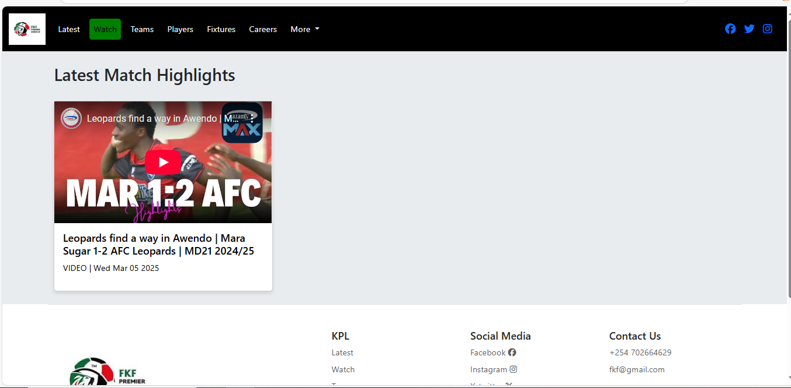
To watch the highlights just click the red play button.

### 3. Teams Page
The teams page displays teams registered in the league.
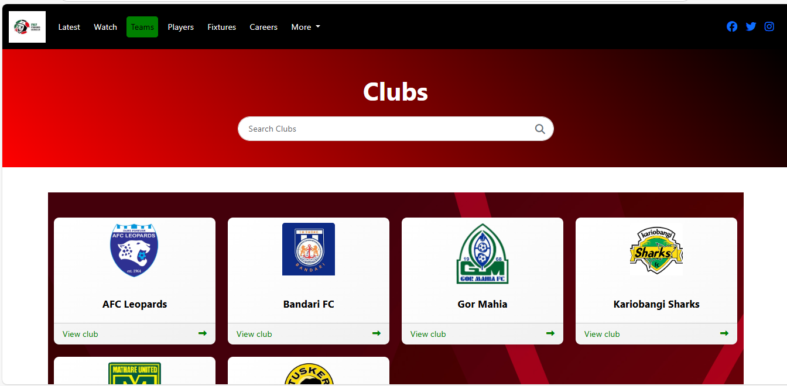
To view a specific club’s website click “View club ->”.
To search for a club click on the input box named “Search Clubs” and enter the club name. Display is toggled as the text is entered.

### 4. Players Page
The players page displays players registered in the league and their stats.
It is divided into two parts:
#### 4.1 Player View
To display the players. A players name, image, club logo, nationality, position and kit number are displayed.
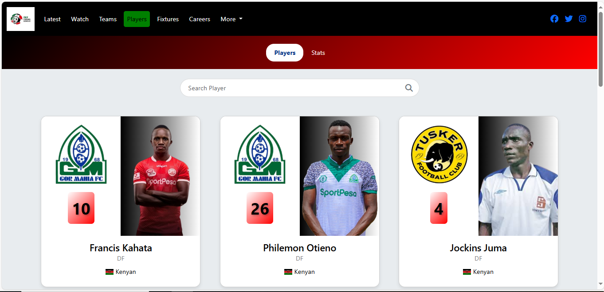
A player can also be searched through the input box at the top.

#### 4.2 Stats View
To display the players statistics. A specific player can also be searched for through the input box at the top.
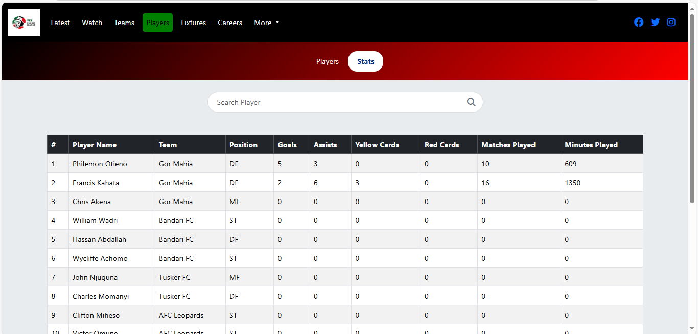

### 5. Fixtures Page
This page contains details of all scheduled league fixtures alongside the results and the league table.
It is divided into three parts:
#### 5.1 Fixtures View
Displays all the league's scheduled fixtures.
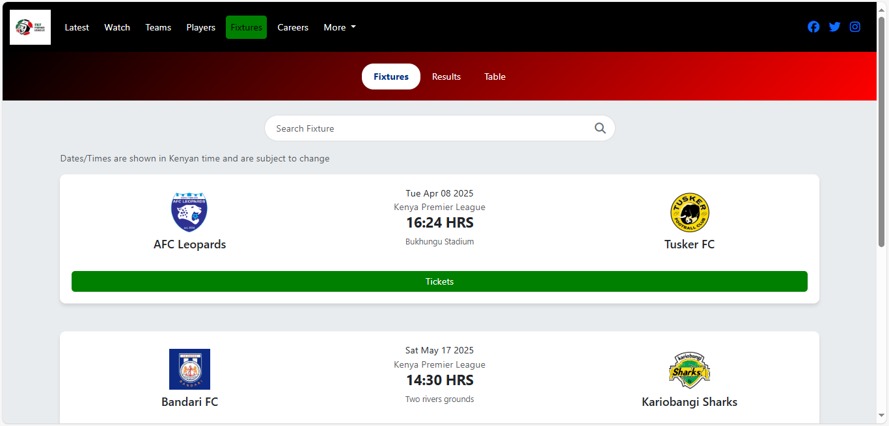
A fixture can also be searched through the input box at the top.

#### 5.2 Results View
To display the fixture results. A specific fixture can also be searched for through the input box at the top.
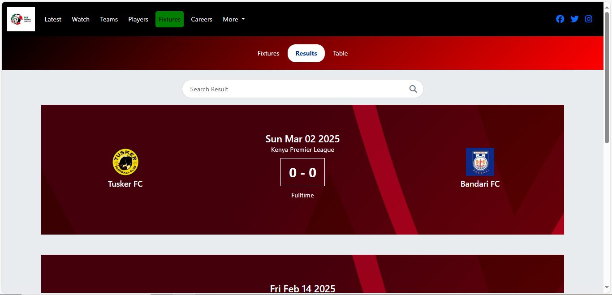
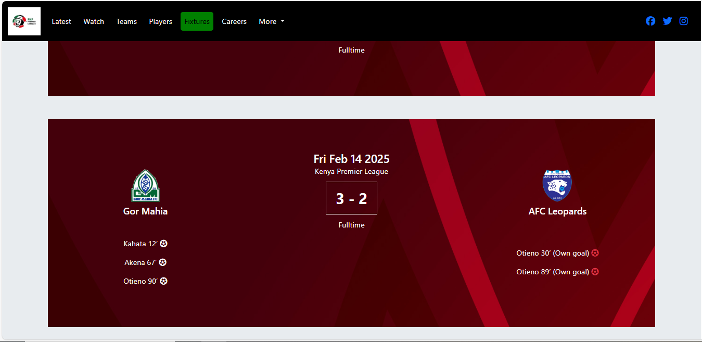

#### 5.3 League Table View
To display the full league standings.
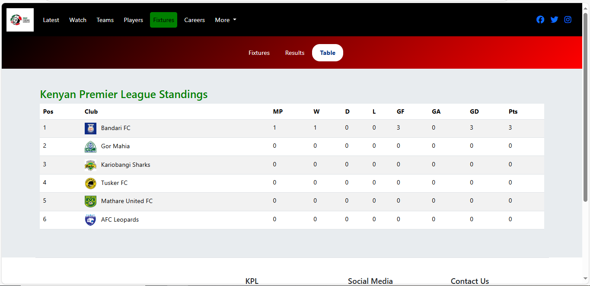

### 6. Careers Page
This page contains details of all job openings in the league.
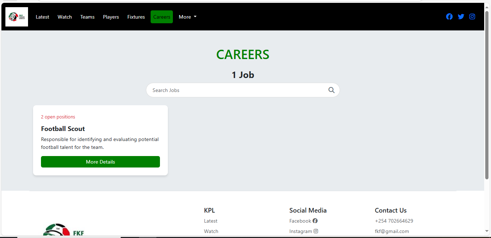

To read the job details click "More Details".
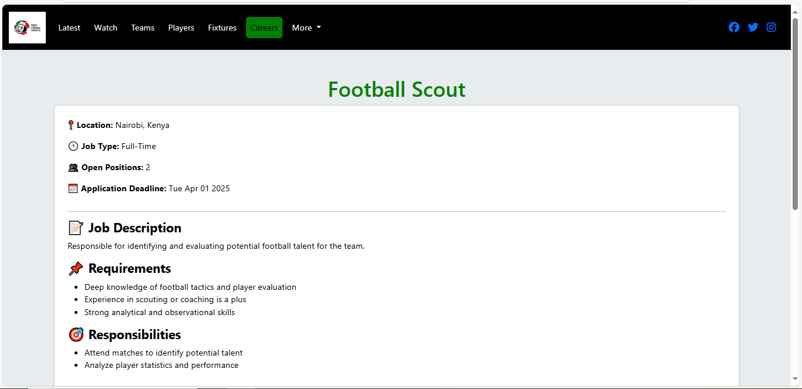
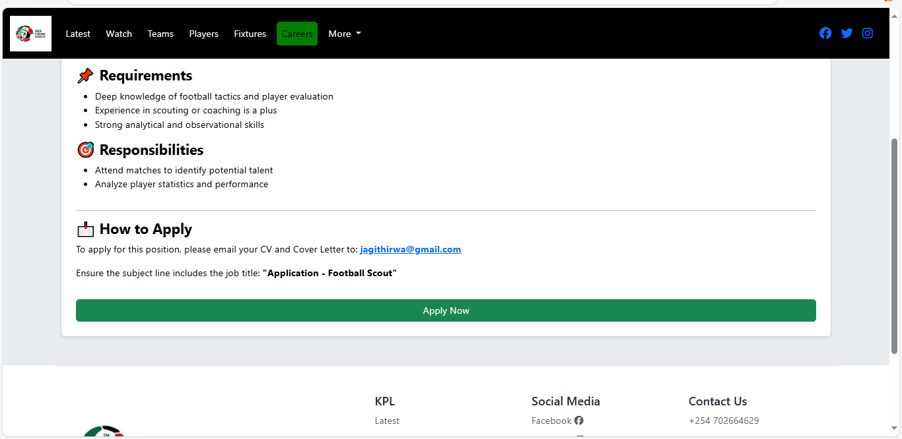

Follow the instructions given. Additionally clicking "Apply Now" redirects users to their email app and they can complete the process there and send.

### 7. More
Additionally, their is an admin side application for managing the league information. To access this, on the navbar at the top click "More", a drop-down appears. Click "Admin" to be redirected to the administration system.

For the admin side demonstration click [here](https://github.com/JemoGithirwa4/Dimba-Itambe-Admin)

Additionally, the website is responsive for different screen sizes.