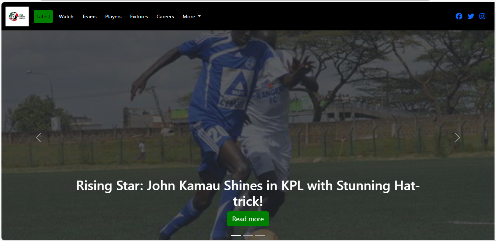
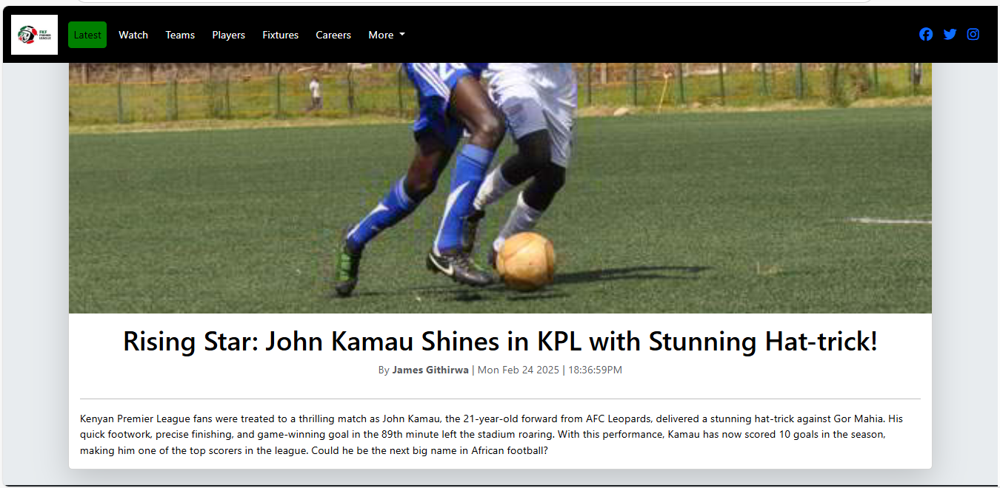
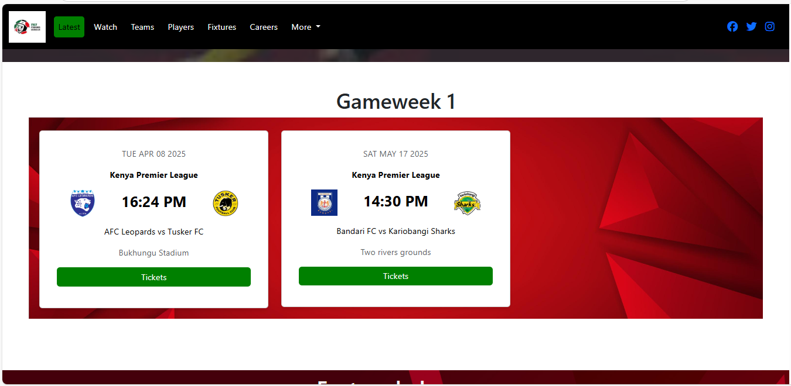
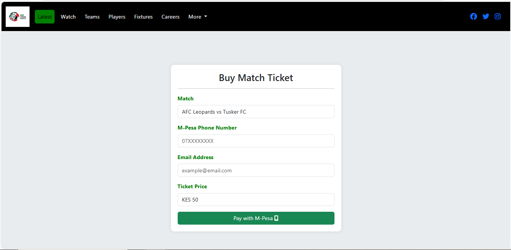
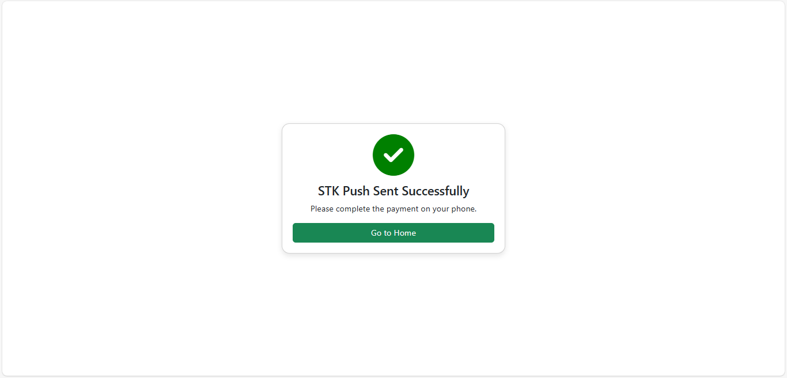
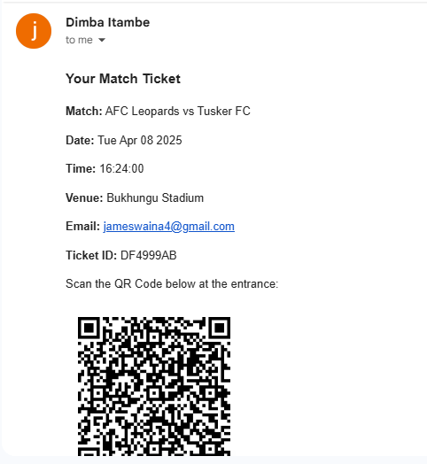
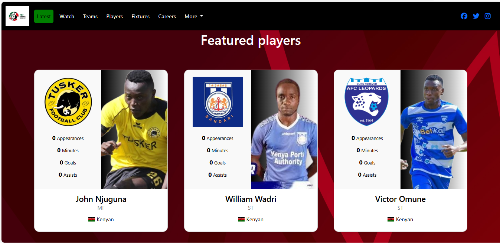

# Dimba Itambe Football League Web Application

A comprehensive football league platform with ticketing, team information and other football league related content.

## Features

- **Ticket Purchasing System**
  - M-Pesa payment integration
  - QR code generation for tickets
  - Email notifications with ticket details
  - Payment callback handling

- **Team & Player Management**
  - Player statistics display
  - Team rosters and information
  - League standings

- **Match Information**
  - Fixtures schedule
  - Match results tracking
  - Goal scorers 

- **Content Display**
  - News articles 
  - Video highlights
  - Job postings/careers section

## Technology Stack

- **Backend**: Node.js, Express.js
- **Frontend**: EJS templates
- **Database**: PostgreSQL
- **Payment Processing**: Safaricom M-Pesa Daraja API
- **Email**: Nodemailer
- **QR Codes**: qrcode library
- **Other**: Axios, body-parser, dotenv, uuid

## API Endpoints

- `GET /` - Home page with latest articles and fixtures
- `GET /article/:id` - View specific article
- `GET /pay-ticket/:matchid` - Ticket purchase page
- `POST /purchase-ticket` - Process ticket purchase
- `POST /mpesa-callback` - M-Pesa payment callback
- `GET /watch` - Video highlights
- `GET /teams` - Team listings
- `GET /players` - Player statistics
- `GET /fixtures` - Match fixtures and results
- `GET /careers` - Job postings
- `GET /job/:id` - Specific job details

## Screenshots
### Home Page
The home page features the latest football updates. It has three parts:
#### Latest articles section####

To read an article click "read more" button. Below is a sample article view:

#### Gameweek fixtures section####

To purchase a ticket click "Tickets".

The user enters their phone number that will make the payment and the email address which the ticket will be sent to. Click “Pay with M-Pesa”. 
An STK push will be received on the phone number entered, enter M-pesa pin to complete the ticket purchase.

Below is how the tcket looks like once payment is completed and sent to the entered email:

#### Featured player section
This contains a profile of 3 chosen players with their various statistics. It keeps changing from time to time.

